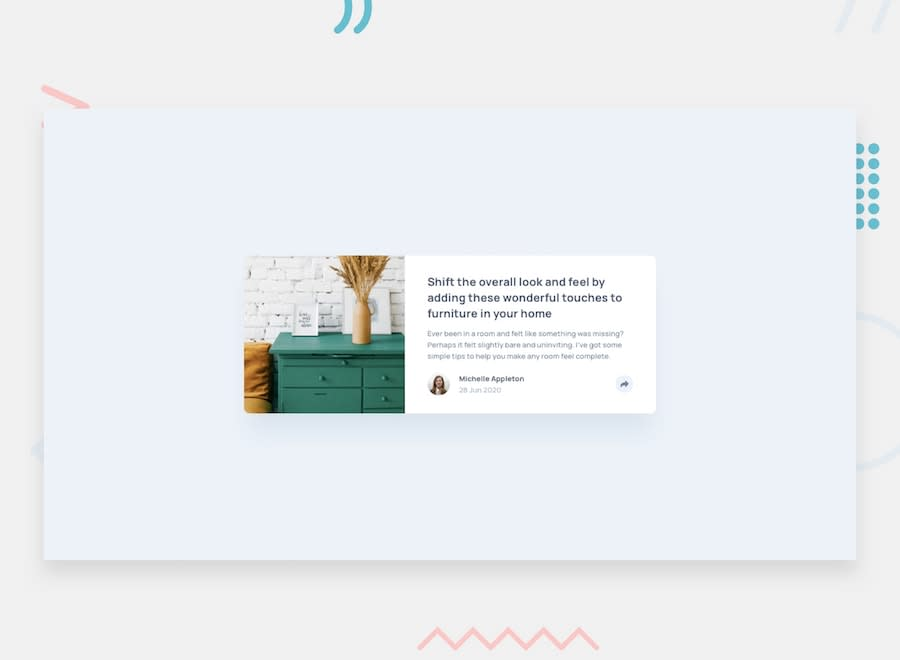

# Frontend Mentor - Article preview component

This is a solution to the [Article preview component](https://www.frontendmentor.io/challenges/article-preview-component-dYBN_pYFT) challenge on Frontend Mentor.

## Table of contents

- [Overview](#overview)
  - [The challenge](#the-challenge)
  - [Screenshot](#screenshot)
  - [Links](#links)
- [My process](#my-process)
  - [Built with](#built-with)
- [Author](#author)

## Overview

### The challenge

Your users should be able to:

- [x] View the optimal layout for the component depending on their device's screen size
- [x] See the social media share links when they click the share icon

### Screenshot

### Links

- Solution URL: [Link](https://www.frontendmentor.io/solutions/article-preview-component-IlS0a4wyI)
- Live Site URL: [Link](https://article-preview-component.sz7kow.com/)

## My process

### Built with

- HTML
- JavaScript
- SCSS

## Author

- Frontend Mentor - [@sz7kow](https://www.frontendmentor.io/profile/sz7kow)
