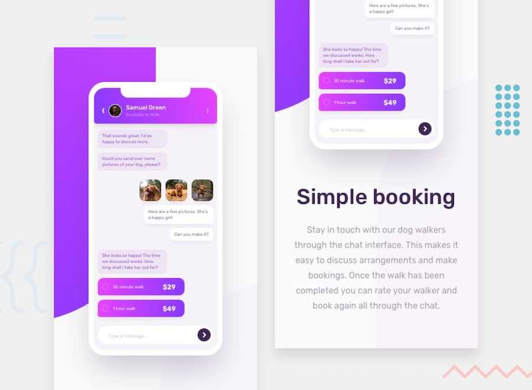

# Frontend Mentor - Chat app CSS illustration

This is a solution to the [Chat app CSS illustration](https://www.frontendmentor.io/challenges/chat-app-css-illustration-O5auMkFqY) challenge on Frontend Mentor.

## Table of contents

- [Overview](#overview)
  - [The challenge](#the-challenge)
  - [Screenshot](#screenshot)
  - [Links](#links)
- [My process](#my-process)
  - [Built with](#built-with)
- [Author](#author)

## Overview

### The challenge

Your users should be able to:

- [x] View the optimal layout for the component depending on their device's screen size
- [x] **Bonus**: See the chat interface animate on the initial load

### Screenshot

### Links

- Solution URL: [Link](https://www.frontendmentor.io/solutions/chat-app-css-illustration--klFjaVB1)
- Live Site URL: [Link](https://chat-app-css-illustration.sz7kow.com/)

## My process

### Built with

- HTML
- Sass

## Author

- Frontend Mentor - [@sz7kow](https://www.frontendmentor.io/profile/sz7kow)
