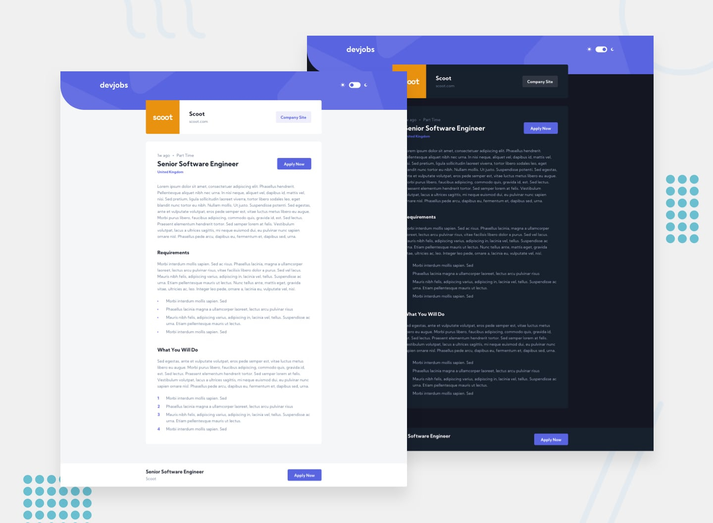

# Frontend Mentor - Devjobs web app

This is a solution to the [Devjobs web app](https://www.frontendmentor.io/challenges/devjobs-web-app-HuvC_LP4l) challenge on Frontend Mentor.

## Table of contents

- [Overview](#overview)
  - [The challenge](#the-challenge)
  - [Screenshot](#screenshot)
  - [Links](#links)
- [My process](#my-process)
  - [Built with](#built-with)
- [Author](#author)

## Overview

### The challenge

Your users should be able to:

- [x] View the optimal layout for each page depending on their device's screen size
- [x] See hover states for all interactive elements throughout the site
- [x] Be able to filter jobs on the index page by title, location, and whether a job is for a full-time position
- [x] Be able to click a job from the index page so that they can read more information and apply for the job
- [x] **Bonus**: Have the correct color scheme chosen for them based on their computer preferences. Hint: Research prefers-color-scheme in CSS.
- [x] **Bonus**: Build this project as a full-stack application

### Screenshot

### Links

- Solution URL: [Link]()
- Live Site URL: [Link](https://devjobs-web-app.sz7kow.com/)

## My process

### Built with

- Next.js
- Prisma
- TailwindCSS
- Typescript
- tRPC

## Author

- Frontend Mentor - [@sz7kow](https://www.frontendmentor.io/profile/sz7kow)
