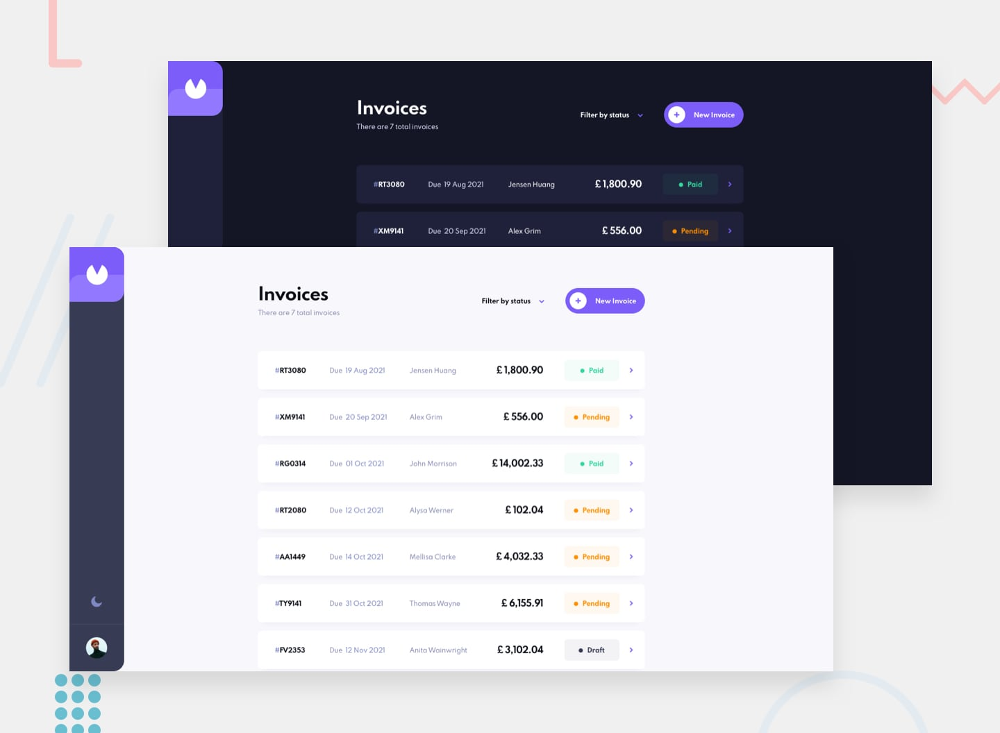

# Frontend Mentor - Invoice App

This is a solution to the [Invoice App](https://www.frontendmentor.io/challenges/invoice-app-i7KaLTQjl) challenge on Frontend Mentor.

## Table of contents

- [Overview](#overview)
  - [The challenge](#the-challenge)
  - [Screenshot](#screenshot)
  - [Links](#links)
- [My process](#my-process)
  - [Built with](#built-with)
  - [Scripts](#scripts)
- [Author](#author)

## Overview

### The challenge

Your users should be able to:

- [ ] View the optimal layout for the app depending on their device's screen size
- [ ] See hover states for all interactive elements on the page
- [ ] Create, read, update, and delete invoices
- [ ] Receive form validations when trying to create/edit an invoice
- [ ] Save draft invoices, and mark pending invoices as paid
- [ ] Filter invoices by status (draft/pending/paid)
- [ ] Toggle light and dark mode
- [ ] **Bonus:** Keep track of any changes, even after refreshing the browser (localStorage could be used for this if you're not building out a full-stack app)
- [ ] **Bonus:** <dev>Build this project as a full-stack application</del>

### Screenshot

### Links

- Solution URL: [Link]("https://invoice-app.sz7kow.com/")
- Live Site URL: [Link]()

## My process

### Built with

- React
- Typescript

## Author

- Frontend Mentor - [@sz7kow](https://www.frontendmentor.io/profile/sz7kow)
