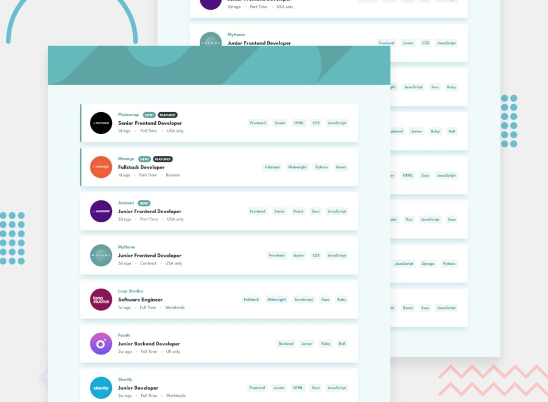

# Frontend Mentor - Job listings with filtering

This is a solution to the [Job listings with filtering](https://www.frontendmentor.io/challenges/job-listings-with-filtering-ivstIPCt) challenge on Frontend Mentor.

## Table of contents

- [Overview](#overview)
  - [The challenge](#the-challenge)
  - [Screenshot](#screenshot)
  - [Links](#links)
- [My process](#my-process)
  - [Built with](#built-with)
  - [Scripts](#scripts)
- [Author](#author)

## Overview

### The challenge

Your users should be able to:

- [x] View the optimal layout for the site depending on their device's screen size
- [x] See hover states for all interactive elements on the page
- [x] Filter job listings based on the categories selected

### Screenshot

### Links

- Solution URL: [Link](https://www.frontendmentor.io/solutions/job-listings-with-filtering-e7dCgroLN)
- Live Site URL: [Link](https://job-listings-with-filtering.sz7kow.com/)

## My process

### Built with

- React
- Styled Components

## Author

- Frontend Mentor - [@sz7kow](https://www.frontendmentor.io/profile/sz7kow)
