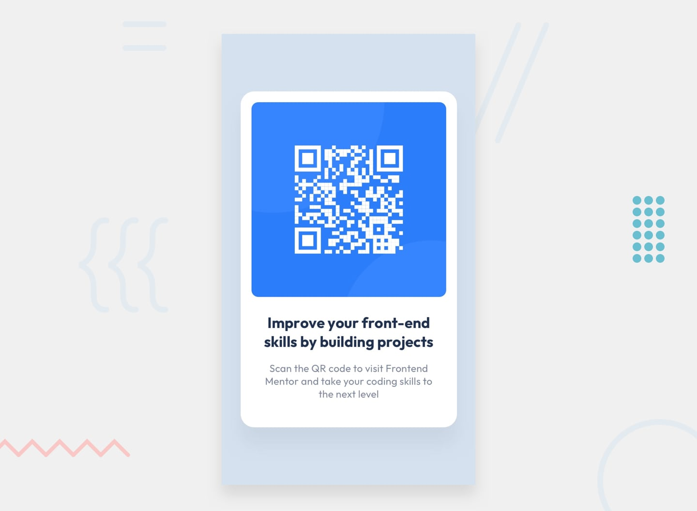

# Frontend Mentor - QR code component

This is a solution to the [QR code component](https://www.frontendmentor.io/challenges/qr-code-component-iux_sIO_H) challenge on Frontend Mentor.

## Table of contents

- [Overview](#overview)
  - [Screenshot](#screenshot)
  - [Links](#links)
- [My process](#my-process)
  - [Built with](#built-with)
- [Author](#author)

## Overview

### Screenshot

### Links

- Solution URL: [Link]()
- Live Site URL: [Link](https://qr-code-component.sz7kow.com/)

## My process

### Built with

- HTML
- SCSS

## Author

- Frontend Mentor - [@sz7kow](https://www.frontendmentor.io/profile/sz7kow)
