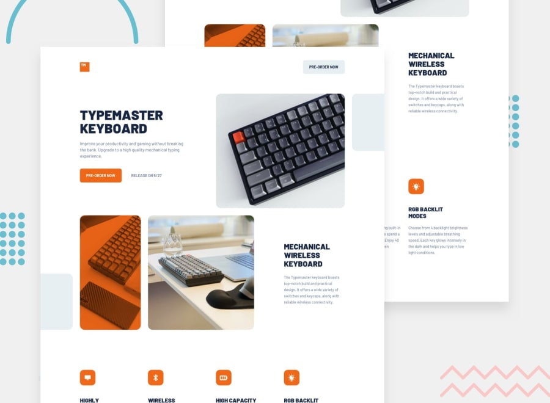

# Frontend Mentor - Typemaster pre-launch landing page

This is a solution to the [Typemaster pre-launch landing page](https://www.frontendmentor.io/challenges/typemaster-prelaunch-landing-page-J6-Yj5J-X) challenge on Frontend Mentor.

## Table of contents

- [Overview](#overview)
  - [The challenge](#the-challenge)
  - [Screenshot](#screenshot)
  - [Links](#links)
- [My process](#my-process)
  - [Built with](#built-with)
- [Author](#author)

## Overview

### The challenge

Your users should be able to:

- [x] View the optimal layout depending on their device's screen size
- [x] See hover states for interactive elements

### Screenshot

### Links

- Solution URL: [Link](https://www.frontendmentor.io/solutions/typemaster-prelaunch-landing-page-G2drEq89Q)
- Live Site URL: [Link](https://typemaster-pre-launch-landing-page.sz7kow.com/)

## My process

### Built with

- HTML
- SCSS

## Author

- Frontend Mentor - [@sz7kow](https://www.frontendmentor.io/profile/sz7kow)
